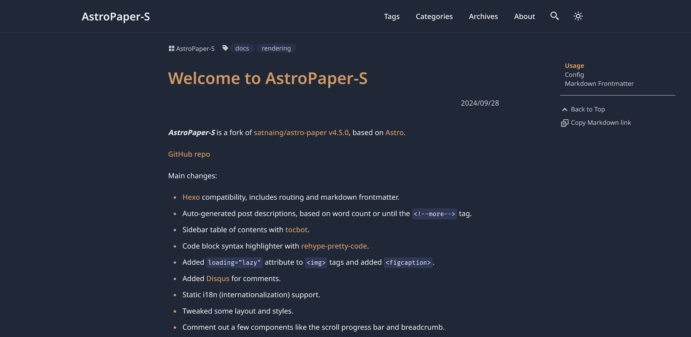

# AstroPaper-S



AstroPaper-S is a fork of [satnaing/astro-paper v4.5.0](https://github.com/satnaing/astro-paper), based on [Astro](https://astro.build/).

Main changes:

- [Hexo](https://github.com/hexojs/hexo) compatibility, includes routing and markdown frontmatter.
- Auto-generated post descriptions, based on word count or until the `<!--more-->` tag.
- Sidebar table of contents with [tocbot](https://tscanlin.github.io/tocbot/).
- Code block syntax highlighter with [rehype-pretty-code](https://github.com/rehype-pretty/rehype-pretty-code).
- Added `loading="lazy"` attribute to `` tags and added `<figcaption>`.
- Added [Disqus](https://disqus.com/) for comments.
- Static i18n (internationalization) support.
- Tweaked some layout and styles.
- Comment out a few components like the scroll progress bar and breadcrumb.

Most of the other features, such as light/dark mode, fuzzy search, sitemap generation, and more, remain largely unchanged.

## Usage

For development:

```bash
pnpm install
pnpm run dev
```

To build static site:

```bash
pnpm run build
```

## Config

[`src/config.ts`](./src/config.ts)

- `website`: Replace this with your deployed domain
- `author`: Your name
- `profile`: Your profile URL
- `desc`: Website description
- `title`: Website title
- `ogImage`: Open Graph image path
- `lightAndDarkMode`: Enable light & dark mode
- `postPerIndex`: Number of posts per index page
- `postPerPage`: Number of posts per /page.
- `postPerArchive`: Number of posts per archive page
- `scheduledPostMargin`: In Production mode, posts with a future date time will not be visible. However, if a post’s date time is within the next `scheduledPostMargin` ms, it will be visible.
- `genDescriptionCount`: Word count for auto-generated post descriptions
- `enableTransitionName`: Enable [Astro Naming a transition](https://docs.astro.build/en/guides/view-transitions/#naming-a-transition)
- `enableGenOgImage`: Enable Open Graph image generation for each posts

> Also see [How to configure AstroPaper theme | AstroPaper](https://astro-paper.pages.dev/posts/how-to-configure-astropaper-theme/)

### Disqus

Please replace your shortname in [`Disqus.astro`](./src/components/Disqus.astro)

```js
(function () {
  // DON'T EDIT BELOW THIS LINE
  const d = document,
    s = d.createElement("script");

  // Please replace SHORTNAME
  s.src = `https://SHORTNAME.disqus.com/embed.js`;
  s.setAttribute("data-timestamp", String(+new Date()));
  (d.head || d.body).appendChild(s);
})();
```

### `_redirects` File

If you need a `_redirects` file for [Netlify](https://docs.netlify.com/routing/redirects/) or [Cloudflare Pages](https://developers.cloudflare.com/pages/configuration/redirects/), you can put it in the [`public`](./public/) folder, files in this folder will be copied into the build folder (ie `dist/`) untouched.

### Static i18n

Look at [`lang.ts`](./src/lang/lang.ts)

Modify `translations` to add new language, and set the desired language using the `USED_LANG` constant

## Markdown Frontmatter

| Property     | Desc                                                                           | Remark                                         |
| ------------ | ------------------------------------------------------------------------------ | ---------------------------------------------- |
| author       | Author of the post                                                             | default = `SITE.author`                        |
| title        | Title of the post                                                              | **required\***                                 |
| subtitle     | Subtitle of the post                                                           | optional                                       |
| description  | Description of the post. Used in post excerpt and site description of the post | optional, auto-generated if not given          |
| date         | published datetime in ISO 8601 format                                          | **required\***                                 |
| updated      | Modified datetime in ISO 8601 format                                           | optional                                       |
| featured     | Whether or not display this post in featured section of home page              | default = `false`                              |
| draft        | Mark this post 'unpublished'                                                   | default = `false`                              |
| tags         | Related keywords for this post. Written in array YAML format                   | default = `["others"]`                         |
| categories   | Categories for this post. Written in array YAML format                         | optional                                       |
| ogImage      | OG image of the post. Useful for social media sharing and SEO                  | default = `SITE.ogImage` or generated OG image |
| toc          | Enable table of contents for this post                                         | default = `true`                               |
| comments     | Enable comments for this post                                                  | default = `true`                               |
| math         | Enable KaTeX for this post                                                     | default = `false`                              |
| canonicalURL | Canonical URL (absolute), in case the article already exists on other source   | default = `Astro.site` + `Astro.url.pathname`  |
| slug         | Slug for the post. This field is optional but CANNOT be an empty string (`""`) | default = slugified file name                  |

> Also see [Adding new posts in AstroPaper theme | AstroPaper](https://astro-paper.pages.dev/posts/adding-new-posts-in-astropaper-theme/) and [`content/config.ts`](./src/content/config.ts)
